Choosing a Git branching strategy can feel like picking a philosophy. It shapes your day-to-day workflow, how often you hit merge conflicts, and most importantly, how stressful release day is for a mobile app team.

This guide walks through three common strategies using one concrete scenario: shipping a change to a payroll app. You’ll see how the same feature moves from development → integration → release → hotfix in each model.

## What you’ll learn

- How **Gitflow**, **Release-Centric (Cascade)**, and **Trunk-Based Development (TBD)** differ in practice
- Where each strategy tends to create friction (merge conflicts, freezes, unfinished work)
- When **feature flags** and **cherry-picks** become essential

---

## The running example: Progressive tax calculation

Imagine you’re working on a payroll app. Today it applies a flat 10% tax:

```dart
/// calculate tax based on 10% of employee salary
double calculateTax(Employee employee) {
  return employee.salary * 0.10;
}
```

**Task:** Implement a progressive tax calculation:

- 0..1000 → 5%
- 1001..2000 → 10%
- 2001+ → 20%

```dart
/// calculate tax based on employee salary bracket
/// 0..1000 tax is 5%
/// 1001..2000 tax is 10%
/// 2001+ tax is 20%
double calculateTax(Employee employee) {
  if (employee.salary <= 1000) {
	  return employee.salary * 0.05;
  } else if (employee.salary <= 2000) {
	  return employee.salary * 0.10;
  } else {
	  return employee.salary * 0.20;
  }
}
```

We’ll follow this same change through **Gitflow**, **Release-Centric**, and **Trunk-Based Development**.

---

# 1) Start the work: where do you branch from?

This step decides what “base” you build on and therefore what risks you inherit (unfinished work, release constraints, etc.).

## Gitflow

You branch from `develop`, the shared integration branch where features land before a release.

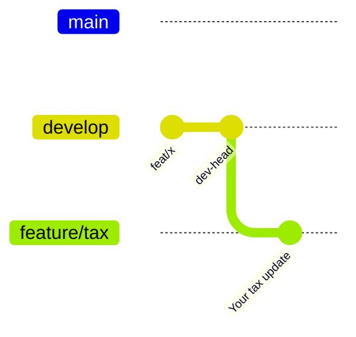

## Release-Centric (a.k.a. Cascade)

You branch from a specific release branch like `release/a.b.c`. You must know which version your feature targets. If the next release is `v1.2.0`, you start from `release/1.2.0`:

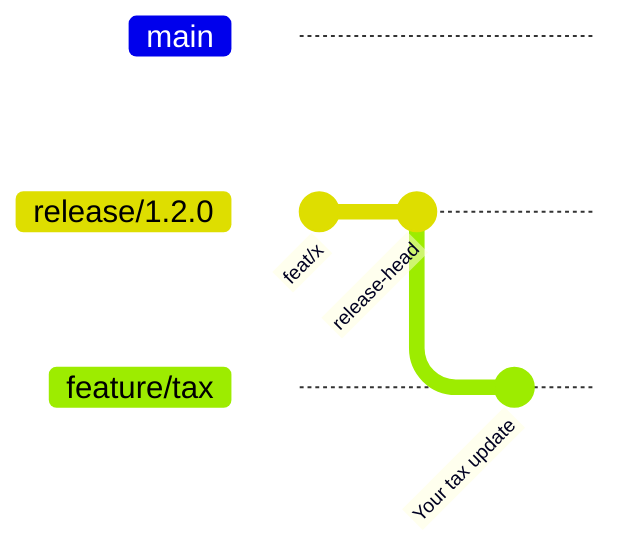

## Trunk-Based Development (TBD)

You branch directly from `main`. There’s no long-lived integration branch.

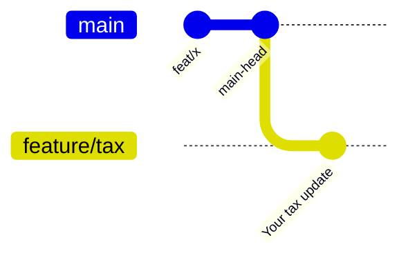

---

# 2) Merge the change: where does it land?

This is where strategies differ on what’s considered “safe enough” to integrate.

## Gitflow

You merge back into `develop`. `develop` is often treated as “unstable”, so incomplete work can exist there temporarily.

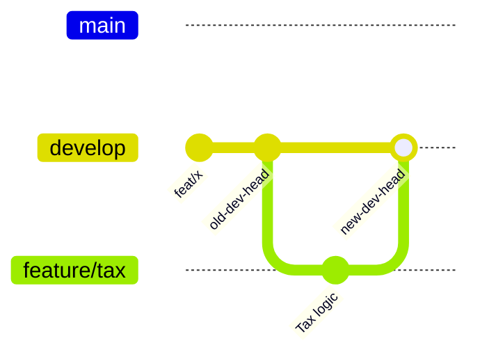

## Release-Centric

You merge into `release/1.2.0`. The expectation is: anything merged here is meant to be release-ready.

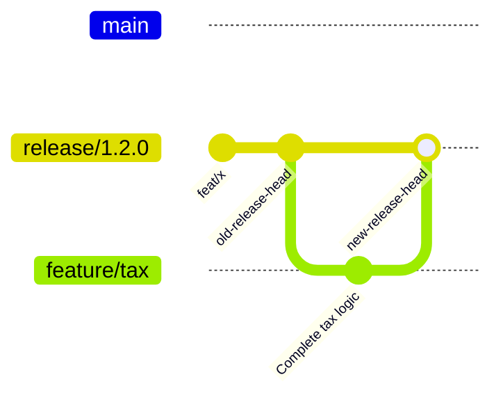

## Trunk-Based Development (TBD)

You merge into `main`. You can merge frequently but you must keep `main` releasable.

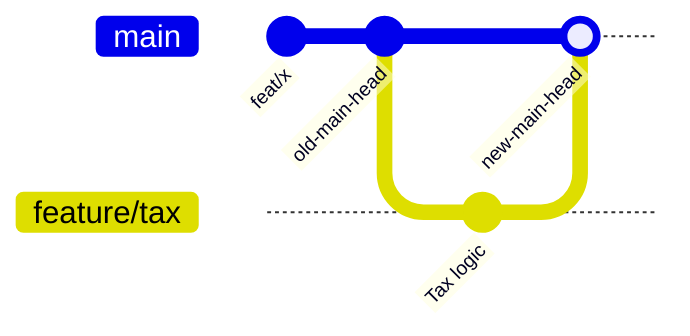

### TBD’s safety mechanism: Feature flags

If the work isn’t ready to be “active”, it must be safe to ship anyway. Feature flags are the most common way to do that.

```dart
/// calculate tax for employee
/// a) default: Flat 10% tax
/// 
/// b) migration flag enabled: Bracket-based calculation
/// - 0..1000 tax is 5%
/// - 1001..2000 tax is 10%
/// - 2001+ tax is 20%
double calculateTax(Employee employee) {
  if (!FeatureFlag.i.isProgressiveTaxEnabled) {
	  return employee.salary * 0.10;
  }

  if (employee.salary <= 1000) {
	  return employee.salary * 0.05;
  } else if (employee.salary <= 2000) {
	  return employee.salary * 0.10;
  } else {
	  return employee.salary * 0.20;
  }
}
```

---

# 3) Prepare a release: how does code get “out the door”?

This is where branching models tend to create the most pain: freezes, reverting unfinished work, and back-merging.

## Gitflow

At the end of a sprint (or when the scope is ready), you cut `release/1.2.0` from `develop`.

- Engineers keep merging new features to `develop`
- Only critical fixes are allowed into the release branch
- After QA signs off, the release branch is merged into **both** `main` and `develop`

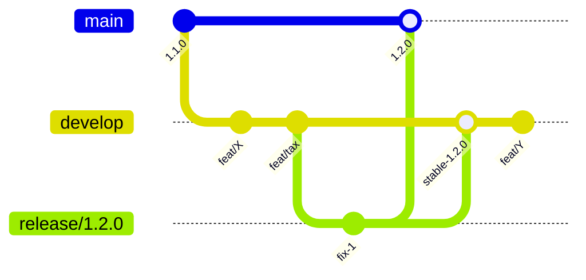

**Common issue:** unfinished work on `develop` can block the release. You either delay the release or revert commits. Feature flags help, but Gitflow doesn’t “force” them the way TBD typically does.

## Release-Centric

The release branch is frozen for a period:

- No new features; only critical fixes
- After QA, merge into `main`
- Then create the next release branch

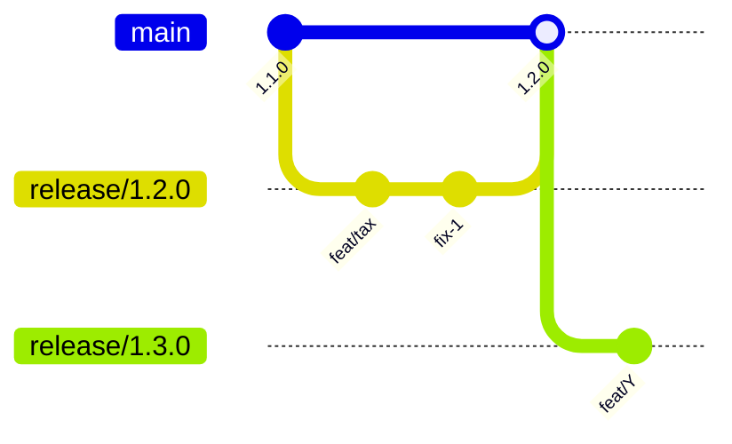

**Trade-off:** this is simple and “safe”, but freezes block integration work. If teams are waiting for `release/1.3.0` to exist, feature branches may hang around unmerged.

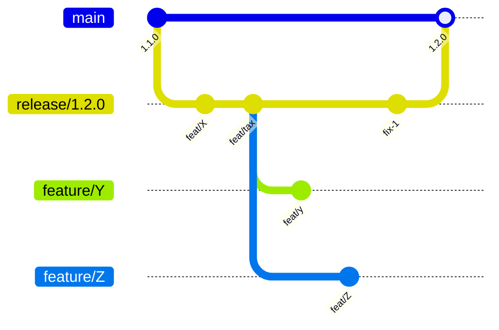

Once a new release branch exists, waiting feature branches can merge (sometimes after rebasing):

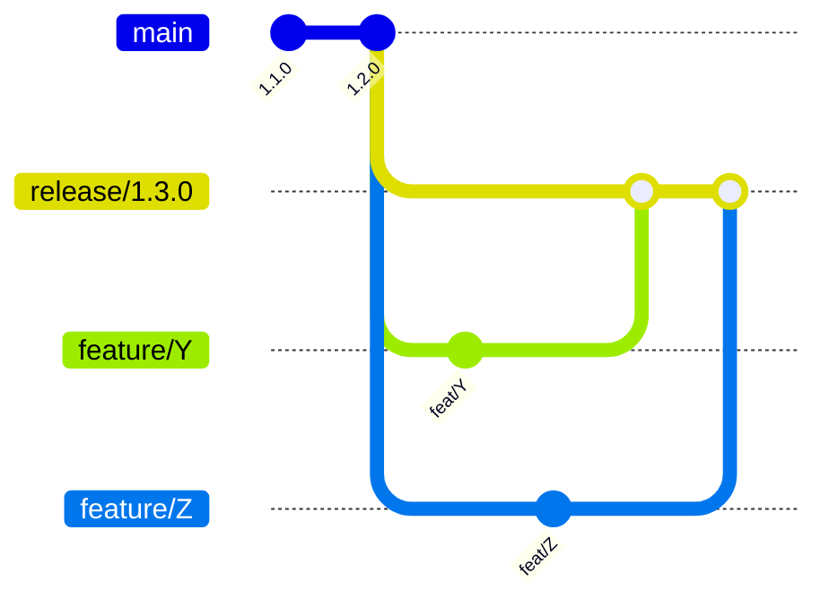

Not only when freeze is in place, the hanging branch problem is also occurred when the change is intended for future versions. It actually solvable with maintaining multiple release branch in parallel, but it rarely adopted due to increased complexity.

## Trunk-Based Development (TBD)

At release time, you cut `release/1.2.0` from `main`.

- Engineers keep merging to `main`
- If QA finds a bug for the release, you fix it on `main` first
- Then **cherry-pick** the fix into the release branch

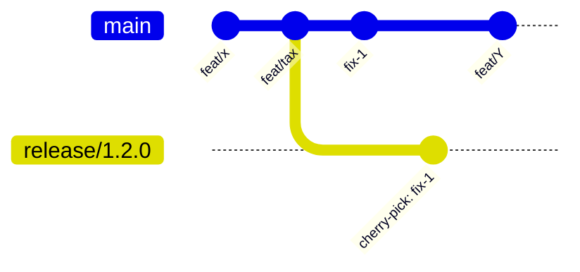

With feature flags, TBD also enables a two-stage rollout for mobile apps:

1. **Staged Binary release:** ship to the App Store / Play Store for 10% → 100%.
1. **Staged Flag rollout:** enable the feature for 10% → 100% of users using flags.

---

# 4) Hotfix: fixing a critical production bug

Assume we shipped the progressive tax code, but we discover a critical issue: the top bracket should be **15%**, but we shipped **20%**.

This is the “hotfix” scenario: you need an urgent patch release.

> 💡 Hotfix is an out-of-band release outside the normal schedule. It requires coordination across engineering, product, QA, and release management, so it’s typically reserved for critical issues where other mitigation (e.g., disabling a flag or backend overrides) isn’t enough.

## Gitflow

You branch `hotfix/` from `main`, fix it, then merge back into **both** `main` and `develop`.

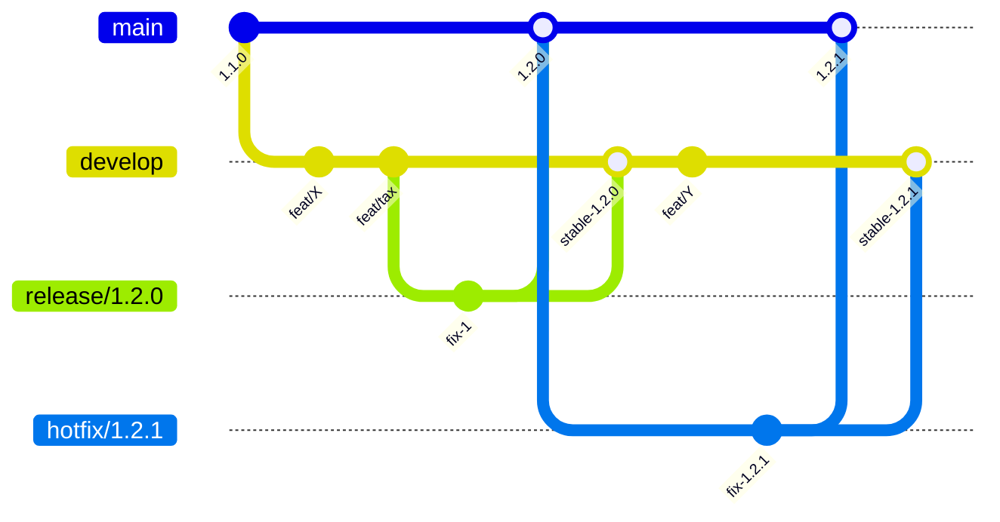

**Pain point:** merge conflicts are common because `develop` often moved far ahead of `main`.

Example: `develop` has a new bracket while `main` contains only the hotfix.

On `develop`:

```dart
/// calculate tax based on employee salary bracket
/// 0..1000 tax is 5%
/// 1001..2000 tax is 10%
/// 2001..3000 tax is 15%
/// 3001+ tax is 20%
double calculateTax(Employee employee) {
  if (employee.salary <= 1000) {
	  return employee.salary * 0.05;
  } else if (employee.salary <= 2000) {
	  return employee.salary * 0.10;
  } else if (employee.salary <= 3000) {
	  return employee.salary * 0.15;
  } else {
	  return employee.salary * 0.20;           // line change on new dev
  }
}
```

On `main` (after the hotfix commit):

```dart
/// calculate tax based on employee salary bracket
/// 0..1000 tax is 5%
/// 1001..2000 tax is 10%
/// 2001+ tax is 15%
double calculateTax(Employee employee) {
  if (employee.salary <= 1000) {
	  return employee.salary * 0.05;
  } else if (employee.salary <= 2000) {
	  return employee.salary * 0.10;
  } else {
	  return employee.salary * 0.15;            // line change on main
  }
}
```

Now you must resolve conflicts when merging the hotfix into `develop` and when merging later releases into `main`.

## Release-Centric

You branch `hotfix/` from `main`, fix it, then backport it into the currently active release branch (e.g. `release/1.3.0`).

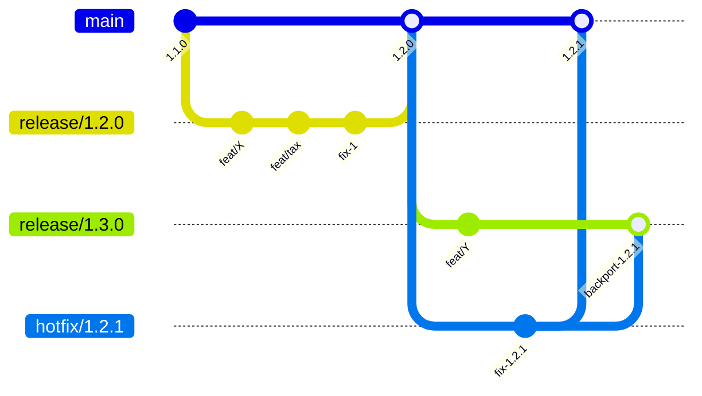

This can still create painful conflicts when the release branch diverged from `main`.

## Trunk-Based Development (TBD)

TBD follows an **upstream-first** rule:

1. Create new release/hotfix branch from current release `release/1.2.0`
1. Fix on `main`
1. Cherry-pick into the release/hotfix branch that needs the patch

> 💡 Some teams prefer to name the hotfix branch `release/1.2.1` instead of `hotfix/1.2.1` where it simply increment the patch version on the semantic versioning.

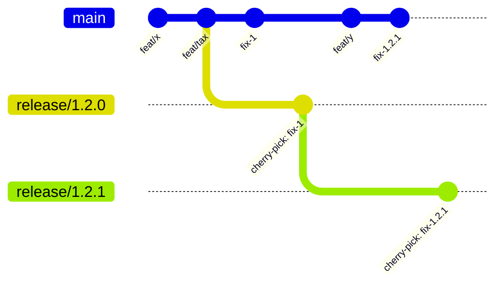

**Why it tends to be easier:** cherry-picking usually moves a small, specific change instead of merging long-lived branches.
### The trade-off: TBD relies on strong feature flag discipline

TBD is great for velocity, but it requires mature operational practices especially around flags.

Common pitfalls:

- Forgetting to wrap a change in a flag
- Inconsistent flag configuration across environments
- Low-level changes (like build settings or app manifests) that can’t be gated by a flag
- Insufficient CI to capture broken logic before merge

---

# Conclusion: pick the strategy that fits your constraints

No single branching strategy wins in every environment.

- Gitflow can work well if you manage incomplete work carefully (often via flags).
- Release-centric branching can feel safer, but freezes can slow integration and feedback.
- Trunk-based development is fast and resilient, but it depends on high-quality CI and feature flag infrastructure.

The best strategy is the one that lets your team ship without fear.
