Choosing a Git branching strategy often feels like picking a philosophy. It dictates your daily rhythm, how often you face the "merge conflict" beast, and how much you sweat on your mobile app release day.

The goal of this article is to explain the three most common strategies step-by-step through a real-world lens, where a mobile app release is never as simple as clicking a "deploy" button.


Imagine you are working on a payroll app. Currently, the app applies a simple 10% flat tax to all salaries:

```dart
/// calculate tax based on 10% of employee salary
double calculateTax(Employee employee) {
  return employee.salary * 0.10;
}
```

**Your Task:** Implement a **Progressive Tax Calculation** to make the system more fair.

```dart
/// calculate tax based on employee salary bracket
/// 0..1000 tax is 5%
/// 1001..2000 tax is 10%
/// 2001+ tax is 20%
double calculateTax(Employee employee) {
  if (employee.salary <= 1000) {
	  return employee.salary * 0.05;
  } else if (employee.salary <= 2000) {
	  return employee.salary * 0.10;
  } else {
	  return employee.salary * 0.20;
  }
}
```

We will follow this task through **Gitflow, Release-Centric** and the **Trunk-Based Development (TBD)** to see which one fits your team best.

# **1. Branching Out and Do The Work**

The first step is creating a working branch from a shared integration branch then makes changes.

## GitFlow

You branch from `develop` branch. This is the shared integration branch where all features live before they are ready for the release.

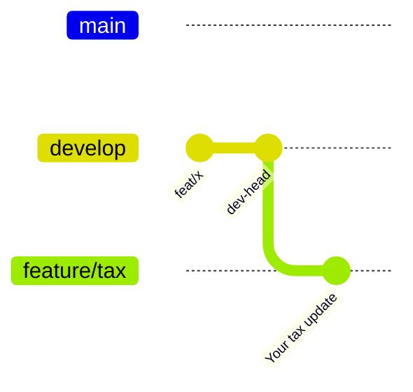

## Release-Centric (a.k.a Cascade)

You branch from a specific `release/a.b.c` branch. You are required to know exactly which version the new code is intended for. If the next release is `v1.2.0`, you must use `release/1.2.0` as your base.

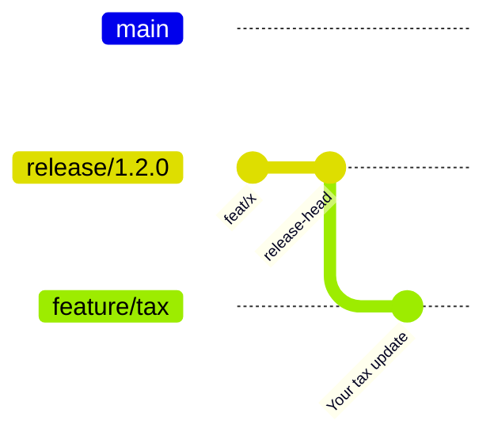

## Trunk-Based Development (TBD)

You branch directly from `main`. There is no middle-man branch, you are working against the latest code that will be released on next version.

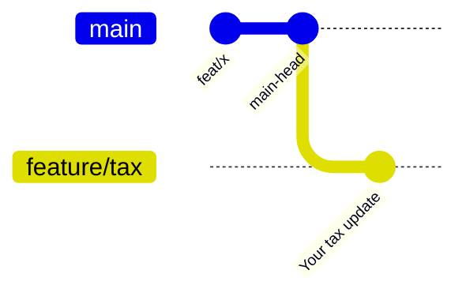

# 2. Merging Back

This is where your code meets everyone else's and conflicts are resolved.

## GitFlow

You merge back into `develop`. In Gitflow, `develop` is considered an "unstable" branch, so it is generally acceptable to have incomplete or experimental code here.

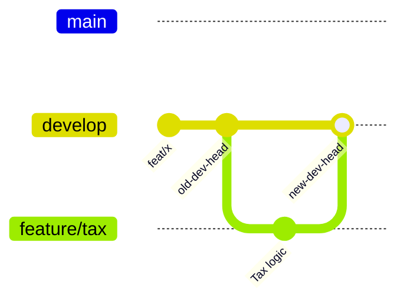

## Release-Centric

You merge into `release/1.2.0`. In this strategy, merged code is expected to be release-ready. You cannot merge "half-finished" work here.

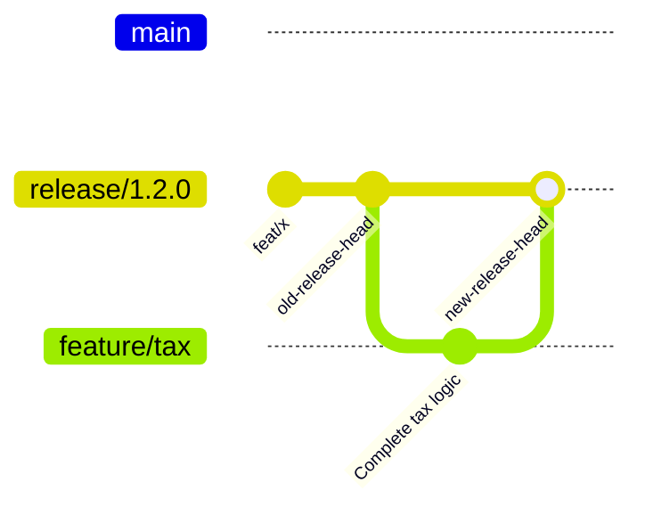

## Trunk-Based Development (TBD)

You merge directly into `main`. Similar to Gitflow, you are allowed to merge incomplete code, but only if it has a **safety guard**.

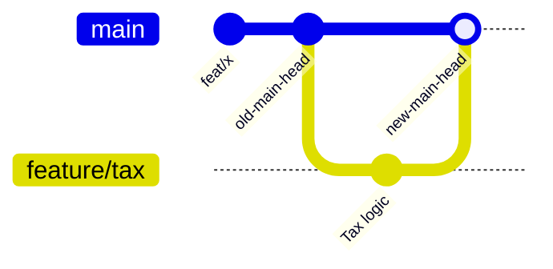

### **The TBD Safety Guard: Feature Flags**

TBD mandates that new code be placed behind a **Feature Flag**. Even when the code is physically in the `main` branch, it is dormant until the business decides to flip the switch.

In our salary app, the implementation looks like this:

```dart
/// calculate tax for employee
/// a) default: Flat 10% tax
/// 
/// b) migration flag enabled: Bracket-based calculation
/// - 0..1000 tax is 5%
/// - 1001..2000 tax is 10%
/// - 2001+ tax is 20%
double calculateTax(Employee employee) {
  if (!FeatureFlag.i.isProgressiveTaxEnabled) {
	  return employee.salary * 0.10;
  }

  if (employee.salary <= 1000) {
	  return employee.salary * 0.05;
  } else if (employee.salary <= 2000) {
	  return employee.salary * 0.10;
  } else {
	  return employee.salary * 0.20;
  }
}
```

# 3. Preparing for Release

So far things look simple, but how you get the code "out the door" is where the headaches usually start.

## GitFlow

When all features for a sprint are done, we cut a `release/1.2.0` branch from `develop`. Engineers continue merging new features to `develop` but only critical bug fixes are allowed into the release branch. Once QA verifies the build, the release branch is merged into both `main` and `develop`.

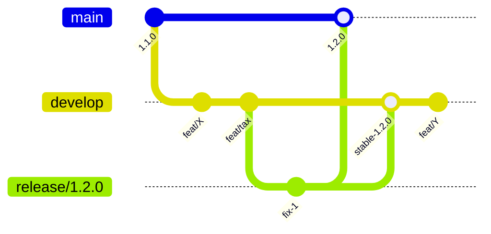

**The Issue:** If a feature on `develop` isn't finished in time, it blocks the entire release train. You either delay the release or painstakingly revert the incomplete commits. While this issue is solvable by implementing feature flag, GitFlow do not require feature flag implementation as aggressive as TBD, which i’ll cover more detail later.

## Release-Centric

The release branch is "frozen" for a specific period. No new features are allowed, only critical bug fixes. Once QA verifies the build, it is merged to `main` and a new release branch is created.

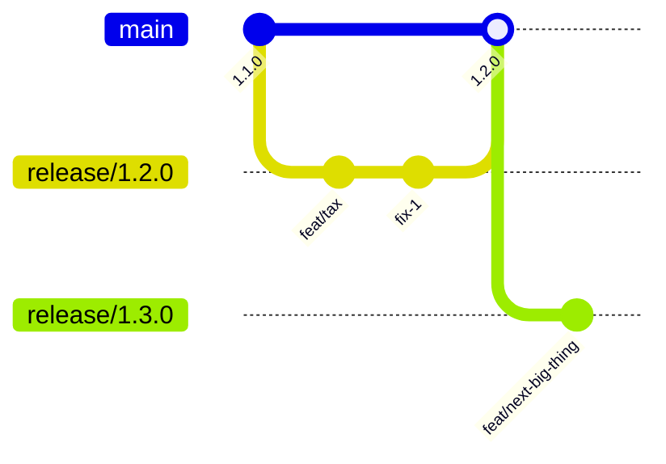

Release centric branches is simpler and considered safer because completion is required early. But it has its own challenges, the freeze period will blocked any merge to integration branch. It essentially halt integration test for new features because the new release branch are yet to be created. Which in turn slow down the development speed in general.

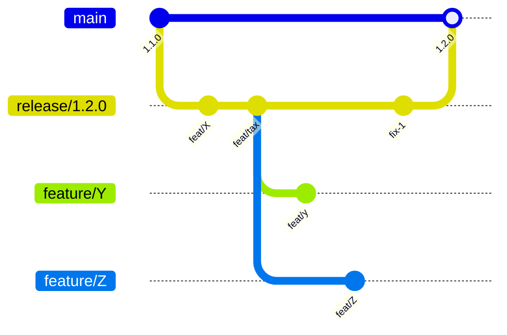

Only once a new release branch created, the unmerged feature branch can be merged, and rebased if necessary, to unblock the integration test.

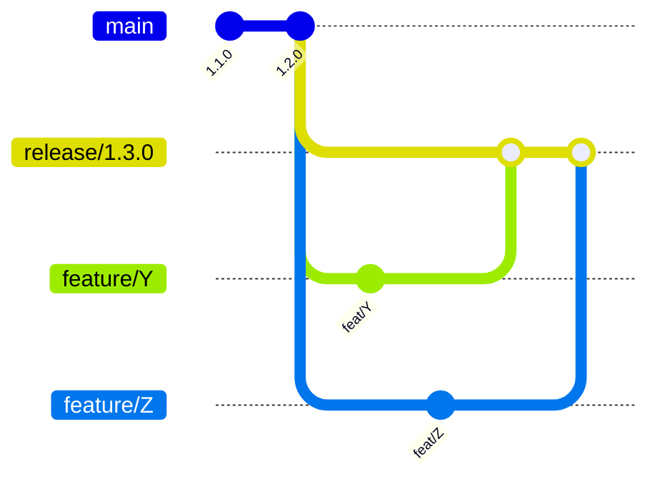

Not only when freeze is in place, the hanging branch problem is also occurred when the change is intended for future versions. Engineer can only merge when the specific branch is available. It actually solvable with maintaining multiple release branch in parallel, but it rarely adopted due to increased complexity.

## Trunk-Based Development (TBD)

Very similar to GitFlow, when the sprint is over and all feature is complete, we cut a `release/1.2.0` branch from `main`. Engineers keep merging to `main`. If a bug is found, we fix it on `main` and **cherry-pick** it into the release branch.

The different is due cherry pick fixes early, after QA verified, there is no longer need to merge back the release branch.

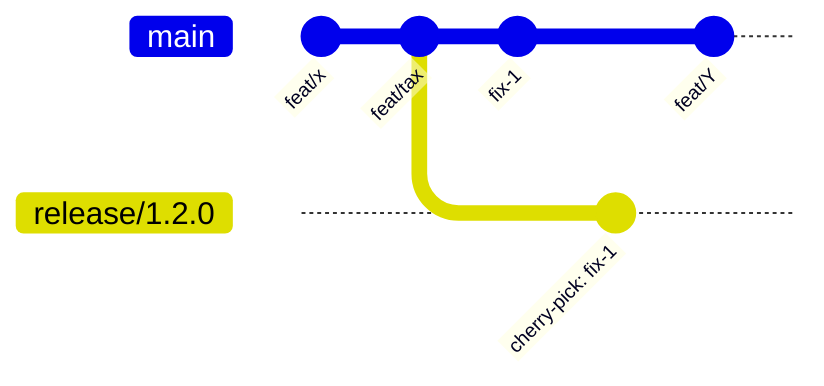

TBD nature is simpler and safer compare to GitFlow and faster compare to Release centric strategy. In addition to that by adding `Feature Flag` check, we can enable a **Two-Way Staged Rollout**:

1. **The Binary Release:** Ship the code to the App Store.
1. **The Flag Release:** Toggle the logic for 10% of users to check the math, then scale to 100%.

Where practically a feature release can target older or newer app version as long as the code is available on that version. This is the secret sauce that makes TBD widely adopted by fast moving teams.

# 4. HotFix: Fixing Critical Uncaught Bug

Let’s say you have a bug on implementation. The tax rate is suppose to be 15% but we put 20%. This is a critical bug. People can be charged more than necessary, it could affects their lives and tax refund processes are complicated. You need a Hotfix!

> 💡 Hotfix is a way to introduce new release outside the standard schedule. A hotfix usually require massive coordination from all stakeholders such as engineer, product owner, QA, release manager and sometimes the head of engineer. Therefore hotfix is typically only allowed for critical uncaught bugs/issues and only as a last measure, where other measures, such as disabling flag and BE update, are unable to resolve the issue.

## Gitflow

You branch `hotfix/` from `main`, fix it, and merge back into `main` and `develop`.

> 💡 Typically hotfix branch will have prefix `hotfix/` , but it also common to see `release/` but with non zero patch version such as `release/1.2.1` .

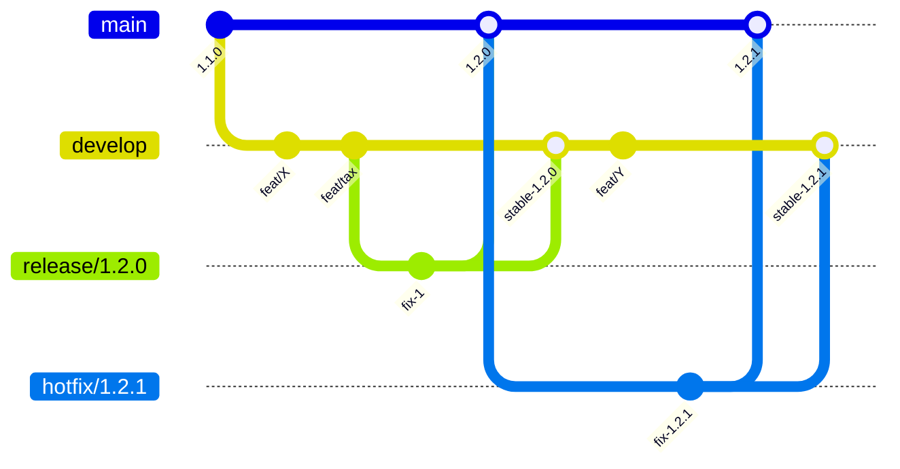

**The Pain Point:** Merge conflicts are frequent here because `develop` has often moved far ahead of `main`. You have to manually resolve conflicts between the production fix and the new code on `develop`.

To illustrate this clearly, lets say you have added a new salary bracket with new rate on develop.

```dart
/// calculate tax based on employee salary bracket
/// 0..1000 tax is 5%
/// 1001..2000 tax is 10%
/// 2001..3000 tax is 15%
/// 3001+ tax is 20%
double calculateTax(Employee employee) {
  if (employee.salary <= 1000) {
	  return employee.salary * 0.05;
  } else if (employee.salary <= 2000) {
	  return employee.salary * 0.10;
  } else if (employee.salary <= 3000) {
	  return employee.salary * 0.15;
  } else {
	  return employee.salary * 0.20;           // line change on new dev
  }
}
```

But on main the commit advanced due to the fix.

```dart
/// calculate tax based on employee salary bracket
/// 0..1000 tax is 5%
/// 1001..2000 tax is 10%
/// 2001+ tax is 15%
double calculateTax(Employee employee) {
  if (employee.salary <= 1000) {
	  return employee.salary * 0.05;
  } else if (employee.salary <= 2000) {
	  return employee.salary * 0.10;
  } else {
	  return employee.salary * 0.15;            // line change on main
  }
}
```

We will need to manually fix the conflict when trying to either merge the hotfix to develop or merge next release to main. While this illustration look simple, it significantly more complex when there are lot of changes between release.

## Release-Centric

You branch `hotfix/` from `main`, fix it, and merge it back into both `main` and current active release branch which is `release/1.3.0`.

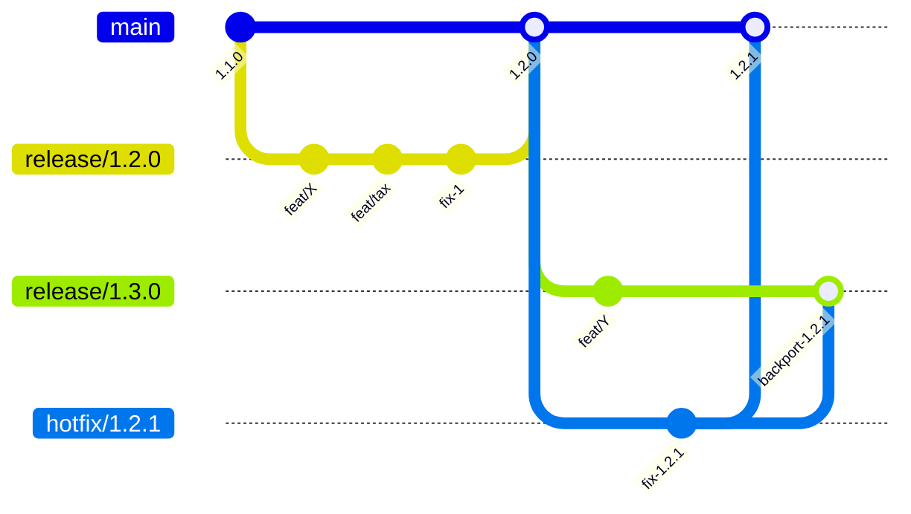

Unfortunately, release centric suffer from same exact conflict resolution problem. We will need to manually fix the conflict when trying to either merge (backporting) the hotfix to next release or merge the next release to main after next release finalized.

## Trunk-Based Development (TBD)

Just like when preparing common release, TBD follows the **Upstream First** rule, fix it on `main` first, then **cherry-pick** that fix into hotfix branch derrived from the problematic release.

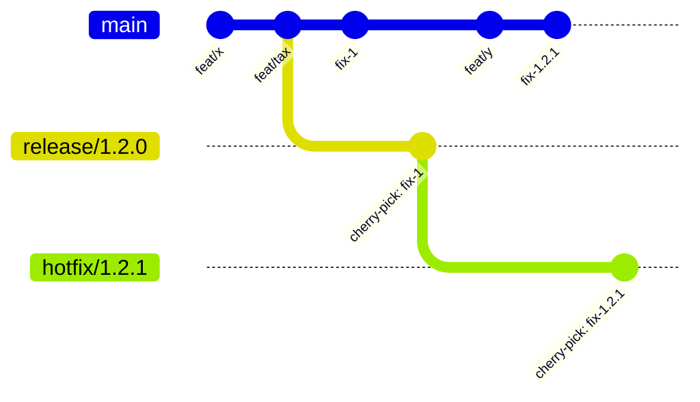

**Why TBD wins here:** Conflict resolution on a cherry-pick is much easier because you are moving a specific, small change rather than merging two long-lived branches.

# 5. The Elephant in the Room: TBD's Feature Flag Reliance

TBD is the gold standard for velocity, but it has a massive dependency: **Feature Flag Infrastructure. **Without robust flags, TBD is a recipe for catastrophic failure. Common pitfalls include:

- Forgetting to wrap a specific change in a flag.
- Inconsistent flag values across different environments.
- Low-level changes (like App Manifests) that cannot be gated by a flag.

# **Conclusion: The Best Strategy is the One That Fits**

Every engineer team might have different situations and unique requirements. One might use GitFlow but adopting heavy feature flag approach or one might adopt cherry picking instead merging back develop/release.

The best strategy is not the one with the fanciest diagram, it is the one that lets your team move without fear.
