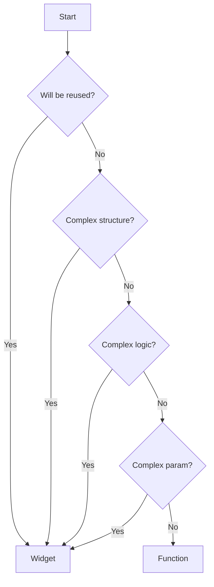

## Introduction
While Flutter documentation often recommends creating `Widget` classes, this isn't always the best approach for all use cases. Especially when handling large codebase you might need to consider just using Functions for simpler widget.
## Decision Tree
The general decision tree when to use functions or classes, is as follow:

As you can see, it’s seems like most branches will lead to `widget` as final decision. Only on one branch/flow that you’ll end up with `function`. But this one specific flow is the one which you’ll keep on facing, may be even 90% of the time. You’ll do better in long run if you choose to just use functions for this case.
## When it’s better to use function
I’ll give you an example, lets say you show an user avatar using `CircleAvatar` in setting page. Then, one day you want to add `onTap` capability on it. You figured that you’ll need to wrap it with an `InkWell`. Based on existing requirement, this additional capability will only available on setting page and nowhere else. Now, you’re left to decide whether to create a new widget or just write a new function in attempt to simultaneously break down the page’s build function.
When this case or any other similar case happen, i’ll suggest you to create a function instead of new widget.
```dart
// DON'T: Create a class for every simple widget
class ClickableCircleAvatar extends StatelessWidget {
  final String url;
	final VoidCallback? onTap;
  
  const UserAvatar({
	  required this.url
	  this.onTap,
  });

  @override
  Widget build(BuildContext context) {
    return InkWell
	    onTap: onTap,
	    child: CircleAvatar(backgroundImage: NetworkImage(url));
	  );
  }
}

// DO: Use functions for simple widgets
Widget userAvatar() => InkWell(
  onTap: controller.onTap,
  child: CircleAvatar(backgroundImage: NetworkImage(state.url));
);
```
This will benefit you in long run due to:
1. Reduced file count or class count, therefore faster compilation times. 
1. Reduced context switching while trying to understand a block of code.
1. Less boilerplate code, therefore introduce little impact to test coverage metric. In the example above, if you write a widget test for it, you’ll need to check both condition where `onTap` is provided and when it’s not. Whereas as a function there is no need to check for that case.
1. Clearer distinction between significant widgets and helper functions.
## When it’s better to use Widget
Theoretically for all other case, but i’ll also give you an example where it does not satisfy the reusability factor, but satisfy the complex structure factor. Let’s say you want to setup your app widget. On this setup, you introduce `MultiProvider` and tons of dependency. For this case it’ll be better if you choose to create a new widget.
```dart
// DON'T: Create a method where return widget for complex widget
Widget buildApp({
  BuildConfig? buildConfig,
	EnvConfig? appConfig,
	...
}) {
  return MultiProvider(
    providers: [
      ...
    ],
    child: MaterialApp.router(
      theme: ...,
      builder: ...,
      routerDelegate: ...,
    )
  );
}

// DO: Use stateless widget for complex widgets
class DemoApp extends StatelessWidget {
  final BuildConfig buildConfig,
	final EnvConfig appConfig,

  const DemoApp({
    required this.buildConfig,
    required this.appConfig,
  });

  @override
  Widget build(BuildContext context) {
    return MultiProvider(
	    providers: [
	      ...
	    ],
	    child: MaterialApp.router(
	      theme: ...,
	      builder: ...,
	      routerDelegate: ...,
	    )
	  );
  }
}
```
This will benefit you in long run due to:
1. Widget will give you access to context. Setting up dependency tends to require context, so making it this way will unlock you from totally dependent to `Provider`.
1. Easier to refactor to stateful in case you need it. Since this is a complex widget, even though you might not need it now, it does have the possibility in future. I already face the problem where someone introduce multiple intermediary method/widget (i.e runMyApp + buildMyApp + RootApp 👀) just because this app setup is a function and not a Widget.
1. And all other benefits that widget brings.
## Last Word
When you’re aiming for advance level, you should understand that everything on software engineering is always a matter of trades off. There is no silver bullet to solve everything. One best practice might not appropriate on all cases.
